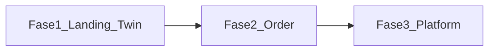

# Rencana Proyek — designtuntas.id

**Brand:** designtuntas.id  
**Tagline:** Desain & dokumen, sampai tuntas.  
**Layanan:** Resume CV · Konsultasi Skripsi · Design Visual · Design 3D  

Dokumen ini merinci **setiap fase** agar bisa direview sebelum implementasi.  
Referensi teknis: project `D:\training\Android studio\Project\site` (`review.md`, `tutorial.md`, Digital Twin + OpenRouter).

**Pondasi bisnis:** Business Model Canvas (BMC) di bawah. Versi Microsoft PowerPoint (`.pptx`) akan digenerate setelah mode Agent diizinkan.

---

## Business Model Canvas — designtuntas.id

*Landasan bisnis sebelum bangun website (Fase 1–3).*

### 1. Customer Segments (Segmen Pelanggan)
- Mahasiswa S1/S2 yang sedang skripsi / butuh dokumen rapi
- Fresh graduate & pencari kerja yang butuh Resume/CV profesional
- UMKM / personal brand yang butuh design visual (logo, feed, presentasi)
- Klien yang butuh visualisasi Design 3D (produk, ruang, mockup)
- Prioritas awal volume: **CV + Konsultasi Skripsi**

### 2. Value Propositions (Proposiasi Nilai)
- **Satu pintu tuntas:** CV, skripsi, visual, dan 3D dalam satu brand
- Hasil **sampai tuntas** (revisi terarah, bukan setengah jadi)
- Proses jelas: chat → brief → revisi → selesai
- Akses cepat lewat WhatsApp + **Digital Twin AI** (jawab FAQ 24/7)
- Harga & paket transparan bertahap (mulai soft-sell, detail harga di fase berikutnya)
- Cocok untuk klien Indonesia (bahasa & konteks lokal)

### 3. Channels (Saluran)
- Website landing `designtuntas.id` / `*.vercel.app` (Fase 1)
- WhatsApp bisnis (konversi utama Fase 1)
- Instagram / TikTok (konten portofolio & edukasi)
- Digital Twin Chat di website (saluran edukasi + lead)
- Nanti: form order (Fase 2), akun + payment (Fase 3)

### 4. Customer Relationships (Hubungan Pelanggan)
- Self-service info via website + AI Twin
- Personal assistance via WhatsApp (brief & revisi)
- Relasi berbasis kepercayaan: update status, revisi terbatas jelas
- Nanti: tracking order (Fase 2), dashboard akun (Fase 3)
- Upsell lintas layanan (mis. CV → design LinkedIn banner)

### 5. Revenue Streams (Aliran Pendapatan)
- Jasa pembuatan Resume/CV (paket / per dokumen)
- Jasa konsultasi skripsi (sesi / paket bab / review)
- Jasa design visual (per project / paket konten)
- Jasa design 3D (per project)
- (Opsional nanti) add-on kilat / revisi ekstra / retainer bulanan
- **Belum** mengandalkan iklan atau langganan SaaS di awal

### 6. Key Resources (Sumber Daya Utama)
- Brand & domain `designtuntas.id`
- Skill: penulisan CV, pendampingan skripsi, desain visual, desain 3D
- Website + Digital Twin (OpenRouter) + nomor WhatsApp
- Portofolio & template kerja
- Waktu founder / tim kecil
- Tools desain (Canva/Adobe/Blender dll. sesuai skill)

### 7. Key Activities (Aktivitas Utama)
- Produksi deliverable (CV, konsultasi, visual, 3D)
- Briefing & manajemen revisi
- Konten marketing (IG/TikTok/portofolio)
- Menjaga website + Twin agar akurat (update data layanan)
- Customer support via WhatsApp
- Nanti: kelola order, payment, dashboard

### 8. Key Partnerships (Kemitraan Utama)
- OpenRouter (AI Twin)
- Vercel (hosting gratis Fase 1)
- (Nanti) Midtrans/Xendit — setelah ada transaksi
- (Nanti) Supabase / storage — Fase 2–3
- Freelancer spesialis (opsional, jika overload)
- Kampus / komunitas mahasiswa (referral, opsional)

### 9. Cost Structure (Struktur Biaya)
**Gratis dulu (kebijakan terkunci):**
- Vercel Hobby, OpenRouter model `:free`, tools gratis yang memadai
- WhatsApp biasa / bisnis sesuai kemampuan

**Berbayar setelah ada transaksi / kebutuhan nyata:**
- Fee payment gateway per transaksi sukses
- Domain `.id` (+ email bisnis, opsional)
- Upgrade DB/storage/AI jika free tier tidak cukup
- Iklan berbayar (opsional, nanti)
- Tools desain berlangganan (jika dibutuhkan)

### Ringkas satu layar (untuk slide PowerPoint)

| Blok kiri | Blok tengah | Blok kanan |
|---|---|---|
| **Key Partners:** OpenRouter, Vercel, (nanti) payment & DB, freelancer | **Value Props:** Satu pintu CV–skripsi–visual–3D, sampai tuntas, AI Twin + WA | **Customer Segments:** Mahasiswa, fresh grad, UMKM, klien 3D |
| **Key Activities:** Produksi jasa, revisi, konten, support | **Customer Relationships:** Twin self-serve + WA personal | **Channels:** Web, WA, IG/TikTok, Twin |
| **Key Resources:** Skill, brand, web+AI, portofolio | | |
| **Cost Structure:** Gratis dulu → bayar saat transaksi/scale | | **Revenue Streams:** Paket CV, skripsi, visual, 3D |

### Status file PowerPoint
- [x] [`designtuntas-BMC.pptx`](designtuntas-BMC.pptx) — selesai (4 slide, desain hangat)
- Isi: cover brand · canvas 9 blok · relasi + kebijakan biaya · roadmap Fase 1–3
- Regenerasi: `python scripts/generate_bmc_pptx.py`

### Knowledge Digital Twin (FAQ)
- Worksheet: [`digital-twin-qa.md`](digital-twin-qa.md) — **sudah diisi & dikunci**
- Keputusan: skripsi = mode A (bantuan naskah) + B (konsultasi/review); harga final OK; **tidak ada refund** (sepakat di awal)
- Asisten: **Tuti AI** · WA: `088901178816`
- Siap masuk `data/services.ts` + system prompt saat implementasi Fase 1

---

## Ringkasan roadmap

| Fase | Nama | Tujuan utama | Status biaya |
|---|---|---|---|
| **1** | Landing + Digital Twin | Website publik + AI asisten + WhatsApp | **Gratis** (Vercel Hobby) |
| **2** | Sistem pesan / order | Form order, notifikasi, tracking sederhana | **Gratis** dulu (free tier) |
| **3** | Platform penuh | Akun user, dashboard, pembayaran | **Gratis/sandbox dulu**; berbayar setelah ada transaksi |

**Kebijakan biaya (disetujui):** pertahankan versi gratis selama memungkinkan. Beralih ke layanan berbayar **hanya setelah ada transaksi nyata**.

**Fase 1 implementasi:** kode di folder [`web/`](web/) — landing + Tuti AI + OpenRouter.  
**Live (Vercel Hobby):** https://designtuntas.vercel.app — homepage + Twin API terverifikasi (publik).  
Cadangan: https://web-chi-ten-37.vercel.app



Prioritas soft di awal: **Resume CV** dan **Konsultasi Skripsi** (permintaan biasanya tertinggi). Empat layanan tetap ditampilkan setara di halaman jasa.

---

## Fase 1 — Landing page + Digital Twin (sekarang)

### Tujuan
Pengunjung mengenal brand, memahami 4 layanan, bertanya ke AI asisten, lalu lanjut order via WhatsApp.

### Ruang lingkup

**A. Landing page**
1. Navbar — logo `designtuntas.id`, anchor section, CTA WhatsApp  
2. Hero full-bleed — brand besar, 1 headline, 1 kalimat pendukung, 1 grup CTA, 1 visual dominan  
3. Layanan — 4 jasa setara (dari data terpusat)  
4. Cara kerja — chat → brief → revisi → tuntas  
5. Portofolio teaser — placeholder siap diganti  
6. CTA penutup + Footer  

**B. Digital Twin Chat (adopsi dari project site)**
1. UI chat client (`DigitalTwinChat`) — Bahasa Indonesia, starter prompts per layanan  
2. API `POST /api/digital-twin` — server-only, panggil OpenRouter  
3. System prompt berbasis fakta layanan designtuntas (bukan profil pribadi project lama)  
4. Soft CTA di chat: arahkan ke WhatsApp untuk order nyata  

**C. OpenRouter**
- Env: `OPENROUTER_API_KEY` (bukan `OPEN_ROUTER` / `OPENROUTE`)  
- Env: `NEXT_PUBLIC_SITE_URL`, `NEXT_PUBLIC_WA_NUMBER`  
- Model free fallback chain (pola project site)  
- Hardening dari `review.md` + kode terkini: rate limit IP, origin check, timeout, sanitasi pesan, error generik ke client  

### Stack teknis
- Next.js (App Router) + TypeScript + Tailwind CSS  
- Deploy: **Vercel Hobby (gratis)** — keputusan Fase 1: tidak upgrade ke Pro  
- Bahasa UI: Indonesia  
- Tanpa database / login / payment  
- URL sementara: `*.vercel.app` (domain `designtuntas.id` ditunda sampai siap beli)  

### Struktur folder (target)

```
/
├── plan.md
├── .env.example
├── package.json
├── app/
│   ├── layout.tsx
│   ├── page.tsx
│   ├── globals.css
│   └── api/digital-twin/route.ts
├── components/
│   ├── Navbar.tsx
│   ├── Hero.tsx
│   ├── Services.tsx
│   ├── HowItWorks.tsx
│   ├── Portfolio.tsx
│   ├── DigitalTwinChat.tsx
│   ├── CtaWhatsApp.tsx
│   └── Footer.tsx
└── data/
    └── services.ts    # single source of truth → UI + system prompt AI
```

### Deliverable Fase 1
- [ ] Website bisa dijalankan lokal (`npm run dev`)
- [ ] Landing lengkap + responsif mobile/desktop
- [ ] Twin menjawab pertanyaan layanan (OpenRouter)
- [ ] Tombol WhatsApp berfungsi (nomor dari env)
- [ ] Deploy ke Vercel (URL `*.vercel.app`)
- [ ] `.env` tidak ikut commit

### Yang Anda siapkan (Fase 1)
1. Akun OpenRouter + API key  
2. Nomor WhatsApp bisnis  
3. (Opsional) logo / foto portofolio  
4. Akun GitHub + Vercel  
5. (Nanti) beli domain `designtuntas.id`  

### Di luar Fase 1
Form order, tracking, login, payment, streaming chat, database riwayat chat, CAPTCHA berbayar.

### Estimasi biaya Fase 1 — kapan berbayar?

**Keputusan terkunci Fase 1:** pakai **Vercel Hobby (gratis)** saja. Tidak berlangganan Vercel Pro. Domain `.id` dan kredit OpenRouter berbayar **ditunda** sampai dibutuhkan.

**Default Fase 1 = gratis.** Hosting Vercel Hobby + model OpenRouter `:free` + WhatsApp CTA tidak wajib bayar.

| Situasi | Wajib bayar? | Perkiraan |
|---|---|---|
| Hanya uji lokal / pakai `*.vercel.app` | Tidak | Rp 0 |
| Beli domain `designtuntas.id` (biar profesional) | **Ya (opsional)** | ~Rp 150–300rb/tahun |
| Traffic Twin sangat tinggi / model free sering limit | **Ya (opsional upgrade)** | kredit OpenRouter pay-as-you-go |
| Vercel Hobby tidak cukup (traffic ekstrem) | Jarang di Fase 1 | baru saat scale besar |
| Nomor WhatsApp / Google Voice berbayar | Tergantung pilihan Anda | biasanya WA biasa cukup gratis |

**Kesimpulan:** di Fase 1 Anda **baru berbayar** terutama saat:
1. memutuskan beli **domain `.id`**, dan/atau  
2. AI Twin sering kena limit model gratis → isi kredit OpenRouter / ganti model berbayar.

Tanpa dua hal itu, Fase 1 bisa jalan dengan **Rp 0**.

### Pelajaran dari review project site (wajib diterapkan)
- Jangan commit kunci API  
- Satu sumber data layanan (hindari drift page vs prompt)  
- Lindungi endpoint AI (rate limit + origin)  
- Visual brand baru (jangan copy ungu/cyan gelap + Inter portfolio lama)  

---

## Fase 2 — Website + sistem pesan / order

### Tujuan
Pengunjung bisa mengirim brief/order tanpa harus mulai dari chat WhatsApp kosong; admin mendapat notifikasi dan bisa update status sederhana.

### Ruang lingkup (usulan)

**A. Form order per layanan**
- Pilih jenis jasa (CV / Skripsi / Visual / 3D)
- Isi nama, kontak, brief, deadline, lampiran (opsional)
- Validasi form di client + server

**B. Penyimpanan order (opsi hemat)**
- **Opsi default (murah/gratis):** Supabase free tier ATAU Google Sheet + Formspree/Email  
- Simpan: ID order, status (`baru` → `diproses` → `revisi` → `selesai`), timestamp

**C. Notifikasi**
- Email/WhatsApp ke admin saat order masuk  
- (Opsional) balasan otomatis ke pelanggan: “Order diterima, kode #DT-xxxx”

**D. Tracking sederhana**
- Halaman `/lacak?kode=DT-xxxx` atau link unik  
- Pelanggan lihat status tanpa login penuh

**E. Twin Chat (lanjutan)**
- Twin boleh bantu isi brief / arahkan ke form order  
- Tetap tidak mengarang harga pasti kecuali data harga resmi sudah ada di `data/`

### Deliverable Fase 2
- [ ] Form order berfungsi end-to-end
- [ ] Admin terima notifikasi order baru
- [ ] Status order bisa diubah (minimal via admin sederhana / sheet)
- [ ] Pelanggan bisa lacak status
- [ ] Rate limit / proteksi spam form

### Estimasi biaya Fase 2
| Item | Biaya |
|---|---|
| Supabase / Sheet / Formspree free | Rp 0 (kuota terbatas) |
| Storage lampiran (jika banyak) | bisa naik bertahap |
| Domain (jika belum) | ~Rp 150–300rb/tahun |

### Di luar Fase 2
Akun pelanggan penuh, gateway pembayaran otomatis, dashboard analitik lengkap, role multi-admin kompleks.

### Keputusan yang perlu Anda approve sebelum Fase 2 mulai
1. Penyimpanan: **Supabase** vs **Google Sheet**  
2. Apakah lampiran file wajib di Fase 2?  
3. Apakah harga paket sudah dipublikasikan di website?  

---

## Fase 3 — Platform penuh (akun + pembayaran + dashboard)

### Tujuan
Operasi bisnis digital lengkap: pelanggan punya akun, bayar online, pantau proyek; admin kelola order, file, dan keuangan dari dashboard.

### Ruang lingkup (usulan)

**A. Autentikasi**
- Daftar / login (email atau Google)
- Role: `customer` dan `admin`

**B. Dashboard pelanggan**
- Daftar order & status  
- Upload brief / revisi  
- Riwayat pembayaran  
- Chat/komentar per order (opsional)

**C. Dashboard admin**
- Kelola order, assign status, unggah hasil  
- Kelola layanan & harga  
- Laporan ringkas (order masuk, selesai, revenue)

**D. Pembayaran**
- Gateway lokal (contoh: Midtrans / Xendit)  
- Invoice + notifikasi bayar sukses  
- (Opsional) DP + pelunasan

**E. Twin Chat (lanjutan)**
- Jawaban lebih personal (order aktif pelanggan)  
- Masih server-side OpenRouter; aturan anti-halusinasi tetap

**F. Keamanan & operasional**
- Rate limit lebih kuat (Redis/Upstash)  
- Backup data  
- Audit log admin  
- Kebijakan privasi & syarat layanan

### Deliverable Fase 3
- [ ] Auth + role berjalan
- [ ] Dashboard customer & admin
- [ ] Payment gateway terhubung (sandbox lalu production)
- [ ] File hasil aman (bukan folder public sembarangan)
- [ ] Monitoring error dasar

### Estimasi biaya Fase 3 — kapan berbayar?

Fase 3 **lebih sering berbayar** daripada Fase 1, karena ada akun, storage file, dan payment gateway. Tapi tidak semua item wajib bayar dari hari pertama — banyak yang mulai gratis lalu naik saat volume tumbuh.

| Situasi | Wajib bayar? | Kapan muncul |
|---|---|---|
| Masih sandbox / uji payment & auth (traffic kecil) | Seringnya **belum** / minimal | Awal build Fase 3 |
| **Payment gateway production** (Midtrans/Xendit) | **Ya (fee transaksi)** | Saat pelanggan benar-benar bayar online |
| Database / auth / storage lewat **free tier** | Tidak dulu | Awal; naik bila user/file banyak |
| Kuota DB / storage / bandwidth habis | **Ya (upgrade plan)** | Saat order & file hasil membludak |
| **Domain `.id` + email bisnis** | **Ya (tahunan)** | Kalau belum dibeli di fase sebelumnya |
| Rate limit Redis/Upstash, monitoring | Opsional berbayar | Saat traffic Twin/API tinggi |
| OpenRouter model non-free | Opsional | Saat model free sering limit |
| Vercel Pro | Opsional / jarang | Hanya jika Hobby tidak cukup |

**Kesimpulan — di Fase 3 Anda berbayar terutama saat:**
1. **Ada transaksi nyata** → fee payment gateway (potongan per pembayaran sukses)  
2. **Data/file/user melebihi free tier** → upgrade database/storage  
3. **Brand production** → domain (+ email bisnis, opsional)  
4. **AI / infrastruktur** butuh performa stabil → kredit OpenRouter / Upstash / Vercel Pro (hanya jika dibutuhkan)

**Yang belum tentu berbayar di awal Fase 3:** biaya langganan besar bulanan, selama masih dalam free tier dan baru sandbox. Biaya paling pasti & rutin adalah **fee per transaksi payment** setelah go-live pembayaran.

### FAQ biaya Fase 3

**Q: Apakah Fase 3 bisa dibuat tanpa berbayar?**  
**A: Bisa untuk tahap build & uji.** Pakai Vercel Hobby, database/auth free tier (mis. Supabase), dan payment **sandbox**. Belum ada pelanggan bayar sungguhan → biasanya Rp 0 / hampir Rp 0.

**Q: Berbayar hanya jika sudah ada transaksi?**  
**A: Untuk fee payment gateway — ya, mulai dari transaksi production pertama yang sukses.** Bukan tunggu “banyak” dulu. Contoh pola umum: potongan % + biaya tetap per pembayaran (mis. ~2%+). Ini dipotong dari uang masuk, bukan langganan bulanan wajib.

**Q: Atau berbayar hanya jika transaksi sudah banyak?**  
**A: Itu untuk biaya platform (database/storage/bandwidth), bukan fee payment.** Free tier cukup selama user/file/order masih kecil. Baru upgrade saat kuota habis / trafik besar.

Ringkas:

| Jenis biaya | Kapan mulai bayar | Dari transaksi ke-1? | Hanya kalau banyak? |
|---|---|---|---|
| Fee Midtrans/Xendit (production) | Saat ada pembayaran sukses | **Ya** | Tidak — tiap transaksi kena fee |
| Upgrade DB / storage / Vercel | Saat lewat free tier | Tidak | **Ya** — saat volume besar |
| Domain / email bisnis | Saat Anda beli | Tidak terkait transaksi | Sekali/tahunan |
| OpenRouter berbayar | Saat free AI tidak cukup | Tidak | Saat pemakaian AI tinggi |

**Keputusan bisnis (terkunci):** tetap pakai **versi gratis** di semua fase selama memungkinkan. **Beralih ke berbayar hanya setelah ada transaksi nyata** (payment production / order berbayar masuk). Sebelum itu: Vercel Hobby, OpenRouter `:free`, DB/auth free tier, payment **sandbox** saja.

**Praktik yang disarankan:** bangun Fase 3 dulu di mode gratis/sandbox → go-live payment saat siap terima order → fee gateway ikut tiap transaksi; langganan besar hanya jika bisnis sudah tumbuh.

### Di luar Fase 3 (masa depan)
App mobile native, marketplace multi-freelancer, AI generate CV otomatis penuh, CRM marketing otomatis.

### Keputusan yang perlu Anda approve sebelum Fase 3 mulai
1. Gateway: **Midtrans** vs **Xendit**  
2. Auth: email/password vs Google login  
3. Legal: teks syarat layanan & privasi  

---

## Matriks fitur antar fase

| Fitur | Fase 1 | Fase 2 | Fase 3 |
|---|---|---|---|
| Landing + branding | Ya | Ya | Ya |
| 4 layanan di halaman | Ya | Ya | Ya |
| WhatsApp CTA | Ya | Ya | Ya |
| Digital Twin + OpenRouter | Ya | Ditingkatkan | Ditingkatkan |
| Form order | — | Ya | Ya |
| Tracking status | — | Ya | Ya |
| Login / akun | — | — | Ya |
| Payment gateway | — | — | Ya |
| Dashboard admin penuh | — | Sederhana | Ya |

---

## Urutan kerja yang disarankan setelah Anda approve

1. **Review & approve dokumen ini** (centang/ubah fase bila perlu)  
2. Approve mulai **Fase 1 saja**  
3. Siapkan OpenRouter key + nomor WhatsApp  
4. Implementasi Fase 1 di workspace ini  
5. Deploy Vercel → uji Twin + WhatsApp  
6. Baru planning detail teknis Fase 2 setelah ada traffic/order nyata  

---

## Catatan penting

- Project baru dibangun di: `d:\Resume CV & Konsultan Skripsi online`  
- Project lama di `D:\training\Android studio\Project\site` **tidak ditimpa**; hanya dijadikan blueprint Digital Twin + OpenRouter  
- Nama env resmi: **`OPENROUTER_API_KEY`**  
- Domain `designtuntas.id` bisa dibeli kapan saja; website bisa live dulu di Vercel  

---

## Persetujuan review

Silakan tandai:

- [x] Fase 1 disetujui seperti tertulis (Vercel gratis / Hobby)
- [x] Kebijakan biaya: tetap gratis dulu; beralih berbayar setelah ada transaksi
- [ ] Fase 2 disetujui secara konsep (detail teknis nanti)
- [ ] Fase 3 disetujui secara konsep (detail teknis nanti)
- [ ] Ada perubahan — tulis di chat / edit bagian terkait

Setelah Fase 1 disetujui untuk dieksekusi, bilang **lanjut bangun Fase 1** / **implement Fase 1**.
